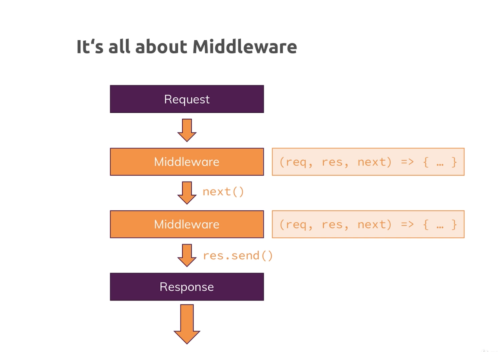

# Node-Js

## Express Js
* Alternatives plain vannila node js , Adonis.js inspired from laravel(php framework), koa , sails... etc

### Install Express
* install as production dependency
```js
npm install --save express
```
* Now use express(app.js)
```js
const http = require('http');

const express = require('express');

const app = express()

const server = http.createServer(app);

server.listen(8000);

```
### Adding Middleware

* Expressjs is all about middleware


* middleware means that an incoming request is automatically funneled through a bunch of functions by expressjs,
* This allows you to split your code into multiple blocks or pieces instead of having one huge function that does everything and this is the pluggable nature of expressjs, where you can easily add other third party packages

```js
const http = require('http');

const express = require('express');

const app = express()

app.use((req, res, next)=>{
    console.log("In the middleware!!");
    next(); //Allow the request to travel on to the next middleware in line
})

app.use((req, res, next)=>{
    console.log("In the another middleware!!")
})

const server = http.createServer(app);

server.listen(8000);

```
* Use allows us to add a new middleware function,

* Now one easy way of using it is that you simply pass a function to it ,this function you pass to app use will be executed for every incoming request !!!.\

* this function will receive three arguments, the request and the response object (request, response, next)

* Next is actually a function, a function that will be passed to use method by expressjs, basically this function(next) you're receiving here has to be executed to allow the request to travel on to the next middleware.

* we have to call next() to allow the request to travel on to the next middleware in line.So it basically goes from top to bottom through that file

* So it basically goes from top to bottom through that file, so if we don't call next, we should actually send back a response because otherwise the request can't continue its journey,

### How Middleware works ??

* Expressjs and that's important doesn't send a default response or anything like that,so instead we should send a response at the end if we don't have any next function.

```js
app.use((req, res, next)=>{
    console.log("In the another middleware!!")
    res.send('<h1>Hello From Express</h1>')
})
```
* Since you sending html the content type is automatically set as html. this is done for us by express.

